# EasyPattern

[](LICENSE) [](https://toyboxpy.io) [](https://github.com/ebeneliason/easy-pattern/tags)

_Easy animated patterns for Playdate._

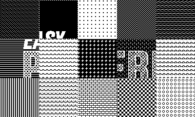

## What is EasyPattern?

EasyPattern is a utility for use with the [Playdate](https://play.date/) SDK that provides a
simple declarative syntax for creating animated patterns. Specify an 8x8 pattern sequence and
any of a variety of easing parameters, and let EasyPattern take care of the rest. Under the
hood it will automatically phase shift your pattern in the horizontal and/or vertical axes to
create a seamless looping pattern texture that can be used with any
[PlayDate drawing calls](https://sdk.play.date/3.0.1/Inside%20Playdate.html#_drawing).

_Playdate is a registered trademark of [Panic](https://panic.com)._

### Table of Contents

1. [Installation](#installation)
2. [Basic Usage](#basic-usage)
3. [Pattern Gallery](#gallery)
4. [Understanding EasyPattern](#understanding-easypattern)
5. [Parameter Reference](#supported-parameters)
6. [Function Reference](#functions)
7. [Examples](#examples)
8. [Demo Swatch](#demo-swatch)
9. [Defining Patterns](#defining-your-patterns)
10. [Troubleshooting & Performance](#troubleshooting)

## Installation

### Installing Manually

1.  Download the [EasyPattern.lua](EasyPattern.lua) file.
2.  Place the file in your project directory (e.g. in the `source` directory next to `main.lua`).
3.  Import it in your project.

    ```lua
    import "EasyPattern"
    ```

### Installing with Toybox

1.  If you haven't already, download and install [`toybox.py`](https://code.malenfant.net/didier/toybox.py).

2.  Add EasyPattern to your project directory:

    ```console
    toybox add ebeneliason/easy-pattern
    toybox update
    ```

3.  Then, if your code is in the `source` directory, import it as follows:

    ```lua
    import '../toyboxes/toyboxes.lua'
    ```

## Basic Usage

### Define Your Pattern

Create an EasyPattern using a simple declarative syntax:

```lua
local checkerboard <const> = { 0xF0, 0xF0, 0xF0, 0xF0, 0x0F, 0x0F, 0x0F, 0x0F }
local easyCheckerboard = EasyPattern {
    pattern  = checkerboard,
    duration = 1.0,
    ease     = playdate.easingFunctions.inOutCubic,
    -- <additional animation params here>
}
```

See the docs for [`init()`](#initparams) and the [list of supported parameters](#supported-parameters).

### Draw With Your Pattern

Set the pattern for drawing with [`apply()`](#apply), for example in your sprite's `draw()` function):

```lua
playdate.graphics.setPattern(easyCheckerboard:apply())
-- draw with your pattern here, using any of the SDKs drawing APIs
```

That's it! The pattern will automatically animate according to the parameters provided. If using
sprites, make sure your sprite has a chance to draw in order to animate the pattern (see below).

### Detect Changes in Your Pattern

Depending on the speed of your animation, chances are the pattern won't update every frame. You can check to see
whether the phase values for the pattern have changed with [`isDirty()`](#isdirty) in order to know when to redraw.
If using sprites, you can mark them dirty when the pattern changes in your sprite's `update()` function:

```lua
if easyCheckerboard:isDirty() then
    self:markDirty()
end
```

## Gallery

Click on any pattern to jump to a complete example with code, or use the provided
[demo swatch](#demo-swatch) to easily try them out for yourself.

[](#conveyor)
[](#scanline)
[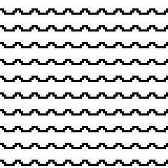](#ooze)
[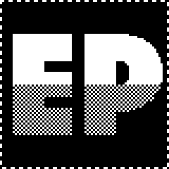](#marching-ants)
[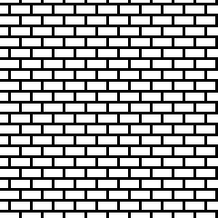](#vertical-bounce)
[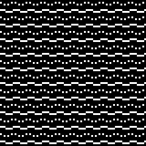](#waves)
[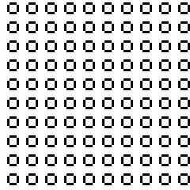](#circular-pan)
[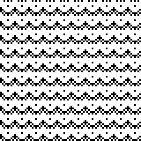](#sway)
[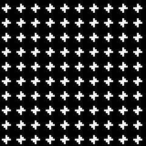](#vibrate)
[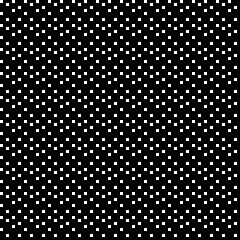](#perlin-noise)
[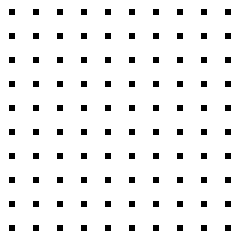](#dot-matrix)
[](#steam)
[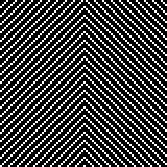](#reflected-patterns)
[](#composite-patterns)
[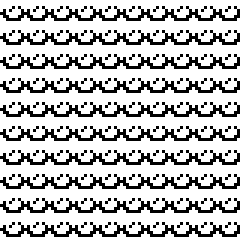](#composite-patterns)
[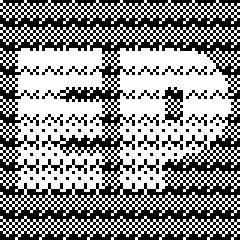](#translucent-patterns)
[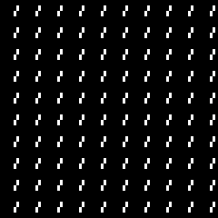](#animated-patterns)
[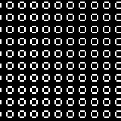](#self-mutating-patterns)
[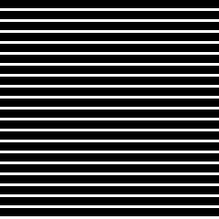](#dynamic-patterns)

## Understanding EasyPattern

EasyPatterns can be thought of in two parts:

1. **Pattern**: A collection of properties that define its overall appearance
2. **Animation**: A collection of properties that define its overall behavior

This section provides context for each of these to help you understand how EasyPattern works, which will
help you reason about how to construct your patterns. The pattern properties converge to define an 8x8
pixel pattern image, and the animation properties converge to define the phase offsets for the pattern in each axis
at the given point in time. These converged values are returned by each call to [`apply()`](#apply), enabling
you to pass them directly to `playdate.graphics.setPattern()` and draw using the animated pattern.

### Types and Compatibility

The types of the core pattern and animation properties match those used elsewhere in the Playdate
SDK to maximize compatibility.

- Patterns are defined in one of several formats, including an array of 8 numbers describing
  the bitmap for each row, with an optional additional 8 for a bitmap alpha channel (as would be passed to
  [`playdate.graphics.setPattern()`](https://sdk.play.date/3.0.1/Inside%20Playdate.html#f-graphics.setPattern)).
- Easing functions are defined in the
  [`playdate.easingFunctions`](https://sdk.play.date/3.0.1/Inside%20Playdate.html#M-easingFunctions) format. You
  can use these functions directly, specify custom functions of your own, or use another library.

### Pattern Composition

EasyPatterns support several parameters representing distinct layers—all of which support transparency—
that get composited to create the final pattern. This diagram describes their order.

**↑ TOP**

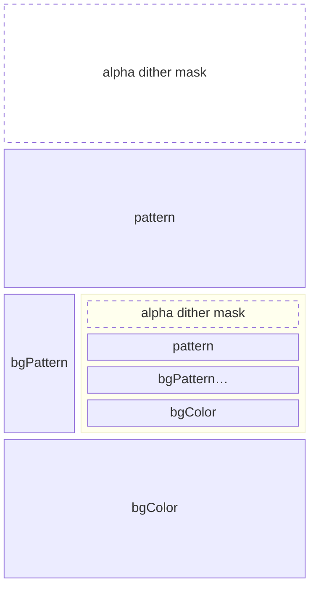

**↓ BOTTOM**

Because the [`bgPattern`](#bgpattern) property may be set to another `EasyPattern` instance, it's possible to
create recursive stacks which compose two or more patterns together as one.

Patterns may also apply an opacity effect via the [`alpha`](#alpha) and [`ditherType`](#dithertype) properties.
This mask remains fixed even as the pattern itself shifts in phase, and applies to all layers of the pattern it's
defined on and any more deeply nested beneath it.

> [!NOTE]
> The current fully-composited pattern image is accessible via the `compositePatternImage` property. Note that this
> represents the raw pattern, before any phase shifts have been applied. However, you should rarely need to access
> this—it's easiest to draw with your pattern by calling [`apply()`](#apply).

### Animation Timing

EasyPatterns are designed to loop continuously. They do so with respect to an absolute clock that
starts the moment the program runs (specifically `playdate.getCurrentTimeMilliseconds()`). _They do not depend on
timers._ Instead, the phase shifts for each axis at the current point in time are computed in closed-form based
on the system clock and their animation properties.

> [!NOTE]
> This approach means that two instances of the same EasyPattern will run in sync with each other regardless
> of when they were initialized or any other timing conditions. If you'd like two of the same EasyPatterns
> (or two different patterns with the same duration) to animate out of phase with each other, adjust the `xOffset`
> and/or `yOffset` for one of them.

To understand how these properties affect the animation, let's look at how the phase is computed at a given
point in time:

```lua
-- assuming time t, xEase ~= nil, and xDuration > 0...
local tx = (t * self.xSpeed + self.xOffset) % self.xDuration
local xPhase = self.xEase(tx, 0, PTTRN_SIZE, self.xDuration, table.unpack(self.xEaseArgs)) * self.xScale % PTTRN_SIZE // 1
```

First, note the time scaling. `tx` is computed based on the current time `t` by scaling it by `xSpeed` (thus slowing
or speeding up time), adding the `xOffset` (thus adjusting the start time), and then modding by `xDuration` (so the
value passed to the easing function is always in the range [0, `xDuration`]).

The adjusted time value is then passed to the specified easing function, which interpolates between 0 and 8
(`PTTRN_SIZE`) over the specified `xDuration`. That result is then multiplied by `xScale` to amplify the phase
shift (for example, setting `xScale` to 2 will cause the pattern to move 16px per loop). Lastly, the result is
modded by 8 and integer-divided by 1 to truncate the final phase to an integer value in the range [0,7].

You can also define other properties that affect the final animation in addition to those that define core timing:

- **Reverses**: Set the [`xReverses`](#xreverses) or [`yReverses`](#yreverses) properties to cause the animation to
  reverse directions at each end. The `xReversed` boolean property will flip with each reversal.
- **Reversed**: Set the [`xReversed`](#xreversed) or [`yReversed`](#yreversed) to cause the animation to run in the
  opposite direction. This may be used with or without "reverses".

### Pattern Transformations

Transformation properties apply to both the fully composited pattern _and its easing animations_. These properties
make it easy to make holistic changes to your patterns without needing to calculate adjustments for each individual
pattern or animation property.

- **Reflection**: Set the [`xReflected`](#xreflected) and [`yReflected`](#yreflected) properties to mirror the
  fully-composited pattern in the horizontal and vertical axes, respectively.
- **Rotation**: Set the [`rotated`](#rotated) property to rotate the fully-composited pattern by 90º, producing
  an orthogonal result.
- **Translation/Phase**: Set the [`xShift`](#xshift) and [`yShift`](#yshift) properties to additively adjust
  the phase offsets of the pattern in each axis. This can be used to make patterns respond dynamically to
  inputs or game states, as described in [`setPhaseShifts`](#setphaseshiftsxshift-yshift).
- **Inversion**: Set the [`inverted`](#inverted) property to cause all white pixels to appear black, and vice-versa.

## Supported Parameters

A full list of supported parameters follows below. Pass a single table containing one or more of these
parameters to [`init()`](#initparams) to define your pattern.

Parameters are grouped into the following categories:

1. [Pattern Parameters](#pattern-parameters): Define the overall appearance of your pattern.
2. [Animation Parameters](#animation-parameters): Define the animation behaviors of your pattern.
3. [Transformation Parameters](#transformation-parameters): Apply simple transformations to your pattern,
   such as translation, reflection, and rotation.
4. [Callback Parameters](#callback-parameters): Set functions to be called when the pattern loops.

The animation and callback parameters may also be set directly on your `EasyPattern` instance at any time after
initialization, e.g.

```lua
easyCheckerboard.xDuration = 0.5
```

### Pattern Parameters

#### `pattern`

An 8x8 pixel pattern specified in one of these formats:

1. **Bit Pattern:** An array of 8 numbers describing the bitmap for each row, with an optional 8 additional for a
   bitmap alpha channel (as would be passed to
   [`playdate.graphics.setPattern()`](https://sdk.play.date/3.0.1/Inside%20Playdate.html#f-graphics.setPattern)).
   See [Defining Your Patterns](#defining-your-patterns) for additional detail on how to construct valid arguments
   for the pattern parameter in this format.

   Example: `pattern = { 0xF0, 0xF0, 0xF0, 0xF0, 0x0F, 0x0F, 0x0F, 0x0F }` (checkerboard)

2. **Dither Pattern:** A table containing:

   - A `ditherType` (as would be passed to `playdate.graphics.setDitherPattern()`. Default: `nil`.
   - An optional `alpha` value in the range [0,1]. Default: `0.5`.
   - An optional `color` value in which to render the dither. Default: `playdate.graphics.kColorBlack`.

   Example:

   ```lua
    pattern = {
      ditherType = playdate.graphics.image.kDitherTypeDiagonalLine,
      alpha = 0.75,
    }
   ```

   As a convenience, if you want the pattern rendered in black at 50% alpha you can assign a bare dither type
   constant to the pattern parameter, skipping the table syntax, e.g.,
   `pattern = playdate.graphics.image.kDitherTypeHorizontalLine`.

3. **Image:** An 8x8 pixel [`playdate.graphics.image`](https://sdk.play.date/3.0.1/Inside%20Playdate.html#C-graphics.image).

   Example: `pattern = playdate.graphics.image.new("images/myPattern")`

4. **Image Table:** An 8x8 pixel
   [`playdate.graphics.imagetable`](https://sdk.play.date/3.0.1/Inside%20Playdate.html#C-graphics.imagetable)
   (for animated patterns). See also: [`tickDuration`](#tickduration).

   Example: `pattern = playdate.graphics.imagetable.new("images/myPattern") -- filename: "myPattern-table-8-8.png" or "myPattern.gif"`

Default: `{ 0xF0, 0xF0, 0xF0, 0xF0, 0x0F, 0x0F, 0x0F, 0x0F }` (checkerboard)

> [!TIP]
> Given the default checkerboard pattern, you can quickly test out easing behaviors before assigning a pattern.

#### `bgPattern`

A pattern to render behind the this one. This may be a pattern of any type supported by the `pattern`
parameter above, or another `EasyPattern` instance. Overlaying EasyPatterns can create interference patterns and
more complex animation behaviors. See [Composite Patterns](#composite-patterns) for an example.

Default: `nil`

#### `bgColor`

The color to use as a background. This is especially useful when specifying a dither pattern, but may be used
with any transparent pattern.

Default: `playdate.graphics.kColorClear`

#### `alpha`

An alpha value indicating the opacity at which to render the pattern. Adjusting this value results in an effect
similar to that provided by `playdate.graphics.image:drawFaded()`. The dither pattern used can be changed via the
`ditherType` property. The alpha dither remains fixed with respect to the screen even as the pattern itself shifts
in phase, causing the pattern to appear to move "beneath" the alpha mask.
See [Translucent Patterns](#translucent-patterns) for an example.

Default `1.0`

#### `ditherType`

A dither type used to render the pattern with reduced opacity when `alpha` is less than 1. This property accepts any
values supported by `playdate.graphics.setDitherPattern()`.

Default: `playdate.graphics.image.kDitherTypeBayer8x8`

#### `inverted`

A boolean indicating whether the pattern is inverted, with any white pixels appearing black, and any black
pixels appearing white. Inverting the pattern does not affect the alpha channel.

Default: `false`

#### `tickDuration`

The number of seconds per "tick", used to determine how long each image of the sequence is shown when either the
pattern and/or background pattern is an `imagetable`.
See [Animated Patterns](#animated-patterns) for an example.

Default: The target FPS, i.e. `1 / playdate.display.getRefreshRate()`

### Animation Parameters

#### `xEase`

An easing function that defines the animation in the X axis. The function should follow the
signature of the [`playdate.easingFunctions`](https://sdk.play.date/3.0.1/Inside%20Playdate.html#M-easingFunctions):

- **`t`**: elapsed time, in the range [0, duration]
- **`b`**: the beginning value (always 0)
- **`c`**: the change in value (always 8 — the size of the pattern)
- **`d`**: the duration

Default: `playdate.easingFunctions.linear`

> [!NOTE]
> Although a linear ease is set by default, it has no effect unless you provide a duration for one or both axes.

#### `yEase`

An easing function that defines the animation in the Y axis. The function should follow the
signature of the `playdate.easingFunctions` as described just above.

Default: `playdate.easingFunctions.linear`

#### `xEaseArgs`

A list containing any additional arguments to the X axis easing function, e.g. to parameterize
amplitude, period, overshoot, etc.

Default: `{}`

#### `yEaseArgs`

A list containing any additional arguments to the Y axis easing function, e.g. to parameterize
amplitude, period, overshoot, etc.

Default: `{}`

#### `xDuration`

The duration of the animation in the X axis, in seconds. Omit this parameter or set it to 0 to
prevent animation in this axis.

Default: `0`

#### `yDuration`

The duration of the animation in the Y axis, in seconds. Omit this parameter or set it to 0 to
prevent animation in this axis.

Default: `0`

#### `xOffset`

An absolute time offset for the X axis animation, in seconds.

Default: `0`

#### `yOffset`

An absolute time offset for the Y axis animation, in seconds.

Default: `0`

#### `xReverses`

A boolean indicating whether the X axis animation reverses at each end.

Default: `false`

#### `yReverses`

A boolean indicating whether the Y axis animation reverses at each end.

Default: `false`

#### `xReversed`

A boolean indicating whether the X axis animation is playing in reverse. This may be set manually,
and also updates automatically when `xReverses` is `true`.

Default: `false`

#### `yReversed`

A boolean indicating whether the Y axis animation is playing in reverse. This may be set manually,
and also updates automatically when `yReverses` is `true`.

Default: `false`

#### `xSpeed`

A multiplier for the overall speed of the animation in the X axis.

Default: `1`

#### `ySpeed`

A multiplier for the overall speed of the animation in the Y axis.

Default: `1`

#### `xScale`

A multiplier describing the number of 8px repetitions the pattern moves by per cycle in the X axis.

Default: `1`

> [!IMPORTANT]
> Non-integer values will result in discontinuity when looping.

#### `yScale`

A multiplier describing the number of 8px repetitions the pattern moves by per cycle in the Y axis.

Default: `1`

> [!IMPORTANT]
> Non-integer values will result in discontinuity when looping.

### Transformation Parameters

#### `xReflected`

A boolean indicating whether the entire pattern should be reflected across the vertical (Y) axis.
See [Reflected Patterns](#reflected-patterns) for an example.

Default: `false`

#### `yReflected`

A boolean indicating whether the entire pattern should be reflected across the horizontal (X) axis.
See [Reflected Patterns](#reflected-patterns) for an example.

Default: `false`

#### `rotated`

A boolean indicating whether the entire pattern should be rotated 90º, producing an orthogonal result.
Rotation is applied following any reflections.

Default: `false`

#### `xShift`

The number of pixels to shift the pattern's phase by in the X axis. This is additive to any computed
phase based on other animation properties, and is applied following any reflections or rotations.

Default: `0`

#### `yShift`

The number of pixels to shift the pattern's phase by in the Y axis. This is additive to any computed
phase based on other animation properties, and is applied following any reflections or rotations.

Default: `0`

### Callback Parameters

These callbacks trigger when the pattern loops—in the X axis, the Y axis, or overall. You can use these
callbacks to modify the pattern itself, or to trigger other effects in sync with its movement.
See [Self-Mutating Patterns](#self-mutating-patterns) for an example.

> [!IMPORTANT]
> Because EasyPattern does not use timers nor have an update function that gets called each frame, these
> callbacks trigger lazily when the pattern crosses a loop boundary while computing new phase offsets
> (such as when checking `isDirty()`, or when calling `apply()`). If you check for dirty and/or draw using
> your pattern each frame, you can ignore this fact. Otherwise, be aware that:
>
> 1. The time between loop callbacks may not be exact, especially if the frame rate is lower.
> 2. The callbacks will not be called _at all_ if the pattern is not being used.

#### `loopCallback`

A function to be called when the pattern loops, taking into account the effective duration of the animation
in each axis including speed and reversal, as well as any animated background pattern. The `EasyPattern` and
total loop count are passed as parameters to the function.

```lua
myEasyPattern.loopCallback = function(p, n)
  print("Looped " .. n .. " times!", p)
end
```

Default: `nil`

#### `xLoopCallback`

A function to be called when the pattern loops in the X axis, taking into account speed and reversal, as
well as any background pattern. The `EasyPattern` and X loop count are passed as parameters to the function.

Default: `nil`

#### `yLoopCallback`

A function to be called when the pattern loops in the Y axis, taking into account speed and reversal, as
well as any background pattern. The `EasyPattern` and Y loop count are passed as parameters to the function.

Default: `nil`

#### `update`

A function to be called immediately before phase computation. You can use this to make any dynamic
adjustments to the pattern based on the current time, game state, or external inputs like the crank.
The `EasyPattern` and the current time are passed as parameters to the function.

For example, the following function updates the Y axis phase shift based on crank input:

```lua
myPattern.update = function(p) p.yShift = playdate.getCrankPosition()//15 end
```

See [Dynamic Patterns](#dynamic-patterns) for a complete example with visual.

## Functions

### Core Functions

#### `init(params)`

EasyPattern takes a single argument — a table of [named parameters](#supported-parameters) that define
both the pattern and animation properties. (This is also why no parentheses are required when defining
a new instance, instead enabling use of `{` and `}` by themselves.)

Most parameters come in pairs to enable setting independent values for the X and Y axes. For
example, `xDuration` and `yDuration`. However, when initializing a new `EasyPattern`, any
of the axis-specific values may be set for both axes at once by dropping the `x` or `y` prefix
from the parameter name, e.g. `duration = 1, scale = 2, reverses = true, ...` and so on. For example:

```lua
local myPattern = EasyPattern {
  pattern   = { 0xF0, 0xF0, 0xF0, 0xF0, 0x0F, 0x0F, 0x0F, 0x0F }, -- checkerboard
  duration  = 1,
  yEase     = playdate.easingFunctions.inOutSine,
  yReverses = true,
}
```

#### `apply()`

_This is where the magic happens._ `apply()` takes no arguments and returns a 3-tuple matching the
signature of [`playdate.graphics.setPattern()`](https://sdk.play.date/3.0.1/Inside%20Playdate.html#f-graphics.setPattern)).
This enables you to pass the result of a call to `apply` directly to the `setPattern()` function without intermediate
storage in a local variable:

```lua
gfx.setPattern(myPattern:apply())
-- draw using your pattern…
```

**Returns:**

- **`patternImage`:** A `playdate.graphics.image` containing the pattern to be drawn.
- **`xPhase`:** The calculated phase offset for the X axis given the current time and other
  animation properties.
- **`yPhase`:** The calculated phase offset for the Y axis given the current time and other
  animation properties.

#### `isDirty()`

Indicates whether the pattern needs to be redrawn based on a change in the phase values since the
last time `apply()` was called. In practice, this means you can check to see if the pattern is dirty
in `update()` and call `markDirty()` on your sprite to ensure `draw()` gets called that frame. This
will work no matter how many sprites use the same pattern for drawing.

```lua
-- e.g. in `sprite:update()`
if myPattern:isDirty() then
  self:markDirty()
end
```

**Returns:**

- **`dirty`**: A boolean indicating whether the pattern needs to be redrawn.

#### `getPhases()`

Inspects the current X and Y phase offsets for the pattern. If the values are stale, new values are
computed when this function is called; otherwise, cached values are returned. You generally won't need
to call this function directly; it is called internally every time you call `isDirty()` or `apply()`.

**Returns:**

- **`xPhase`**: A number representing the current phase offset for the X axis in the range 0..7.
- **`yPhase`**: A number representing the current phase offset for the Y axis in the range 0..7.
- **`recomputed`**: A boolean indicating whether the values were newly computed.

### Pattern Functions

The pattern and background pattern may be set with the functions below. The provided overrides to `setPattern(...)`
and `setBackgroundPattern(...)` taken together allow setting new patterns using any of the formats supported
by the `pattern` param when passed to `init()`.

> [!TIP]
> Setting a background pattern is substantially more performant than drawing one pattern atop another, as only
> the 8x8 pattern gets composited (and only in frames when it changes). All other drawing is only done once.
>
> Given that you can set another `EasyPattern` as a background, you can also create chains to compose 3 or more
> patterns and achieve more complex effects.

#### `setPattern(pattern)`

Sets a new pattern with a bitmap provided as a sequence of bytes.

**Params:**

- **`pattern`:** An array of 8 numbers describing the bitmap for each row, with an optional
  additional 8 for a bitmap alpha channel, as would be supplied to `playdate.graphics.setPattern()`.

#### `setPattern(ditherType, [alpha], [color])`

Generates a new pattern with the provided `ditherType`, as well as the optional `alpha` and `color` values.
The pattern is rendered with transparency, by default. To obtain an opaque result, set a complementary `bgColor`
on the `EasyPattern`.

**Params:**

- **`ditherType`:** The dither to render as a pattern, which may be any supported by
  `playdate.graphics.setDitherPattern()`.
- **`[alpha]`:** The opacity to render the dither pattern with. Default: `0.5`.
- **`[color]`:** An optional color to render the pattern in. Default: `playdate.graphics.kColorBlack`.
  (This argument is only required to render the pattern in `playdate.graphics.kColorWhite`.)

#### `setPattern(image)`

Sets the pattern using the provided image.

**Params:**

- **`image`:** A `playdate.graphics.image`, which should be 8x8 pixels in size.

#### `setPattern(imageTable, [tickDuration])`

Sets the pattern using the provided image table. Once set, the pattern will automatically update to show
a looping sequence of images from the image table, advancing once per tick.

**Params:**

- **`imageTable`:** A `playdate.graphics.imagetable`, which should be 8x8 pixels in size and may have as many
  images as desired.
- **`[tickDuration]`:** An optional value specifying the number of seconds between ticks at which the pattern
  advances to the next image in the sequence. This is a convenience which sets the `tickDuration` property when
  setting a pattern, though it may also be set directly.

> [!NOTE]
> The number of images in the provided sequence has no effect on the X, Y, or total calculated loop duration,
> which reports only with respect to the easing animation loops.

#### `setBackgroundPattern(pattern)`

Sets a new background pattern with a bitmap provided as a sequence of bytes.

**Params:**

- **`pattern`:** An array of 8 numbers describing the bitmap for each row, with an optional
  additional 8 for a bitmap alpha channel, as would be supplied to `playdate.graphics.setPattern()`.

#### `setBackgroundPattern(ditherType, [alpha], [color])`

Sets a new background pattern generated using the provided `ditherType` and `alpha` values, as well
as an optional `color` in which to render the pattern. The pattern is rendered with transparency, by
default. To obtain an opaque result, set a complementary `bgColor` on the `EasyPattern`.

**Params:**

- **`ditherType`:** The dither pattern to render as a pattern, which may be any value supported by
  `playdate.graphics.setDitherPattern()`.
- **`[alpha]`:** The opacity to render the dither pattern with. Default: `0.5`.
- **`[color]`:** An optional color to render the pattern in. Default: `playdate.graphics.kColorBlack`.
  (This argument is only required to render the pattern in `playdate.graphics.kColorWhite`.)

#### `setBackgroundPattern(image)`

Sets the background pattern using the provided image.

**Params:**

- **`image`:** A `playdate.graphics.image`, which should be 8x8 pixels in size.

#### `setBackgroundPattern(imageTable, [tickDuration])`

Sets the background pattern using the provided image table. Once set, the pattern will automatically update to show
a looping sequence of images from the image table, advancing once per tick.

**Params:**

- **`imageTable`:** A `playdate.graphics.imagetable`, which should be 8x8 pixels in size and may have as many
  images as desired.
- **`[tickDuration]`:** An optional value specifying the number of seconds between ticks at which the pattern
  advances to the next image in the sequence. This is a convenience which sets the `tickDuration` property when
  setting a pattern, though it may also be set directly.

> [!NOTE]
> The number of images in the provided sequence has no effect on the X, Y, or total calculated loop duration,
> which reports only with respect to the easing animation loops.

#### `setBackgroundPattern(easyPattern)`

Sets the background pattern to another `EasyPattern` instance, enabling composition of multiple animated layers.
The background `EasyPattern` will animate independently of its parent (its X and Y phases will not be impacted by
those of the overlaid pattern).

> [!NOTE]
> The X, Y, and total loop durations of the parent `EasyPattern` will adjust to account for those of its background,
> such that the reported values indicate a return of both patterns to their initial state.

**Params:**

- **`easyPattern`:** An `EasyPattern` instance to use as a background.

#### `setBackgroundColor(color)`

Sets the background color shown behind any transparent areas in the `pattern` and `bgPattern`.

**Params:**

- **`color`:** A `playdate.graphics` color constant.

#### `setAlpha(alpha, [ditherType])`

Sets the opacity of the fully-composited pattern.

**Params:**

- **`alpha`:** The desired opacity, in the range [0, 1].
- **`[ditherType]`:** The dither type used as an alpha mask, which may be any value supported by
  `playdate.graphics.setDitherPattern()`.

#### `setInverted(flag)`

Inverts the resulting pattern, causing any white pixels to appear black and any black pixels to appear white.
The alpha channel is not affected.

**Params:**

- **`flag`:** A `boolean` indicating whether the pattern is inverted.

### Transformation Functions

#### `setPhaseShifts(xShift, [yShift])`

Sets the X and Y phase shift values. If `yShift` is omitted, both X and Y phases are set to the same value.
These phase shifts are _additive_ to (rather than override) any shifts in phase resulting from the animation
parameters applied to your pattern.

This can be used to enable dynamic pattern behaviors driven by external game logic. Here are
a few examples:

1. A conveyor belt pattern which animates according to the crank speed
2. A landscape pattern (e.g. platforms, trees) that's shifted a bit for each instance to help them appear
   as distinct entities even though they share the same pattern
3. A parallax effect, which shifts the animated pattern laterally as the player moves left and right

The image below illustrates one such application. The phases of the `EasyPattern` applied to the ball
are shifted dynamically based on the ball's velocity. This creates the illusion that the ball is rolling
and spinning as it travels down the lane.

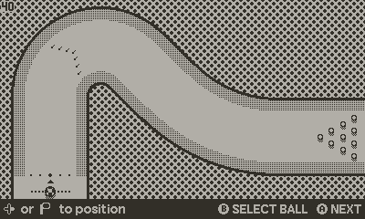

**Params:**

- **`xShift`:** The phase shift in the X axis
- **`yShift`:** The phase shift in the Y axis

Note that these values may also be set directly on an `EasyPattern` instance. However, calling this function
ensures that the resulting phase values are correct immediately, rather than lazily computed the next time
the pattern is applied.

**Returns:**

- **`dirty`**: A boolean indicating whether the set caused the phase values to update.

#### `shiftPhasesBy(xShift, [yShift])`

A convenience function that sets the phase shifts by offsetting them by the specified amount from their
current values. If `yShift` is omitted, both X and Y phases are shifted the same amount.

**Params:**

- **`xShift`:** The amount to to shift the phase by in the X axis
- **`yShift`:** The amount to to shift the phase by in the Y axis

**Returns:**

- **`dirty`**: A boolean indicating whether the shift caused the phase values to update.

#### `setReflected(horizontal, [vertical])`

Sets the `xReflected` and `yReflected` properties indicating in which axes the pattern should be inverted.
If the second argument is omitted, both axes are set to the same value.

**Params:**

- **`horizontal`:** A `boolean` indicating whether the pattern is reflected horizontally across the Y axis.
- **`horizontal`:** A `boolean` indicating whether the pattern is reflected vertically across the X axis.

#### `setRotated(flag)`

Sets the `rotated` property, indicating whether the pattern should be rotated 90º to produce an
orthogonal result.

**Params:**

- **`flag`:** A boolean indicating whether the pattern is rotated.

### Looping Functions

#### `getLoopDuration()`

Returns the total effective loop duration of the pattern in seconds, taking into account the duration of
the animation in each axis including speed and reversal, as well as any background pattern.

#### `getXLoopDuration()`

Returns the total effective loop duration of the pattern in the X axis in seconds, taking into account its
speed and reversal as well as any background pattern.

#### `getYLoopDuration()`

Returns the total effective loop duration of the pattern in the Y axis in seconds, taking into account its
speed and reversal as well as any background pattern.

> [!NOTE]
> These functions ignore the length of any sequences set on the pattern or background pattern using an `imagetable`.
> They only reflect the total duration of easing animations in each axis or overall.

## Examples

These examples demonstrate the range of pattern animations possible with EasyPattern. Each
is shown with a standard checkerboard pattern to compare the easing effect, and with a custom
pattern intended to illustrate a potential application.

You can try these examples yourself using the included [EasyPatternDemoSwatch](EasyPatternDemoSwatch.lua).
[See below](#demo-swatch) for instructions, as well as docs for [BitPattern](#defining-your-patterns) which
enables the ASCII pattern representations seen in many of these examples.

### Conveyor Belt

This example utilizes the built-in vertical line dither type to create a simple horizontally
scrolling conveyor belt effect. Because the dither effect naturally has transparency, a
`bgColor` is specified so that the resulting belt pattern is fully opaque. Achieve belt effects
moving in different directions by either:

1. Specifying the horizontal dither type and `reversed` as needed
2. Using a combination of `reflected` and `rotated` to reorient the pattern

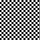
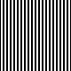


**Demo Swatch ID:** `conveyor`

```lua
EasyPattern {
    pattern  = playdate.graphics.image.kDitherTypeVerticalLine,
    duration = 0.5,
    bgColor  = playdate.graphics.kColorWhite,
}
```

> [!NOTE]
> Because the provided dither pattern is rendered in black at 50% alpha, we can assign the dither constant
> directly to the pattern parameter.

### Scanline

This example utilizes the built-in horizontal line dither, including transparency, to create a simple
scanline effect. This could be used atop an image or rendered scene to simulate an old monitor.

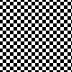
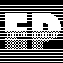
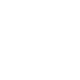


**Demo Swatch ID:** `scanline`

```lua
EasyPattern {
    pattern = {
        ditherType = playdate.graphics.image.kDitherTypeHorizontalLine,
        color      = gfx.kColorWhite,
        alpha      = 0.8,
    },
    duration   = 0.5,
    yReversed  = true,
}
```

> [!NOTE]
> Unlike the previous example, a table is provided for the pattern parameter in order to adjust the color and
> alpha values used to generate the pattern with the given the dither.

### Ooze

Adding a custom pattern to a default linear ease in the vertical axis produces imagery
that evokes landscapes such as a waterfall, sand dunes, lava, or gooey ooze.

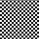 


**Demo Swatch ID:** `ooze`

```lua
ooze = EasyPattern {
    pattern = BitPattern {
        ' X X X X X X X X ',
        ' X X X X X X X X ',
        ' X X X X X X X X ',
        ' . . X X X X X . ',
        ' X . . X X X . . ',
        ' X X . . . . . X ',
        ' X X X X X X X X ',
        ' X X X X X X X X ',
    },
    yDuration = 1,
    yReversed = true,
},
```

### Marching Ants

This example creates a "marching ants" dotted outline effect, as is often used to indicate
rectangular selections. To achieve the effect, use this pattern in conjunction with a call
to `drawRect(r)`. Modulate the length of the dashes with the `alpha` parameter.


**Demo Swatch ID:** `ants`

```lua
EasyPattern {
    ditherType = playdate.graphics.image.kDitherTypeDiagonalLine,
    xDuration  = 0.25,
    bgColor    = playdate.graphics.kColorWhite
}
```

### Vertical Bounce

In this example, the pattern appears to fall downward one block at a time, bouncing to a
settled state before the next row drops out. The `scale` parameter is used to exaggerate
the effect, causing it to fall by multiple rows per cycle.


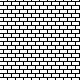


**Demo Swatch ID:** `bounce`

```lua
EasyPattern {
    pattern = BitPattern {
        ' . . . . . . . . ',
        ' X X X . X X X X ',
        ' X X X . X X X X ',
        ' X X X . X X X X ',
        ' . . . . . . . . ',
        ' X X X X X X X . ',
        ' X X X X X X X . ',
        ' X X X X X X X . ',
    },
    yDuration = 1,
    yEase     = playdate.easingFunctions.outBounce,
    yReversed = true,
    scale     = 2,
}
```

### Waves

This example uses a sinusoidal ease in the vertical axis to create a simple wave motion, paired
with a linear ease in the horizontal axis to illustrate directional flow. You can combine
different easing functions and even different timing values for each axis to achieve more nuanced
effects.


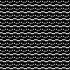


**Demo Swatch ID:** `waves`

```lua
EasyPattern {
    pattern = BitPattern {
        ' . . . . . . . . ',
        ' . X . . . . . X ',
        ' . . . X . X . . ',
        ' . . . . . . . . ',
        ' . . . . . . . . ',
        ' X X X X . . . . ',
        ' . . . . X X X X ',
        ' . . . . . . . . ',
    },
    xDuration = 0.5,
    yDuration = 1.0,
    yEase     = playdate.easingFunctions.inOutSine,
    yReverses = true,
}
```

### Circular Pan

This example makes use of built-in sine functions and an `xOffset` to create a continuous
circular panning movement.

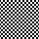
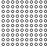


**Demo Swatch ID:** `circle`

```lua
EasyPattern {
    pattern = BitPattern {
        ' X X X X X X X X ',
        ' X X . . . X X X ',
        ' X . X X X . X X ',
        ' X . X X X . X X ',
        ' X . X X X . X X ',
        ' X X . . . X X X ',
        ' X X X X X X X X ',
        ' X X X X X X X X ',
    },
    duration  = 1,
    ease      = playdate.easingFunctions.inOutSine,
    xOffset   = 0.5, -- half the duration
    reverses  = true,
    scale     = 3,
}
```

### Sway

This example shows how changing a few parameters can create substantially different effects.
Subtle adjustments to the above example yield a gentle swaying motion.

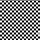
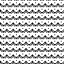


**Demo Swatch ID:** `sway`

```lua
EasyPattern {
    pattern = BitPattern {
        ' X X X X X X X X ',
        ' X X X X X X X X ',
        ' X X X X . X X X ',
        ' . X X X X X X X ',
        ' . . X X X X X . ',
        ' . X . X X X . X ',
        ' X . X . . . X . ',
        ' X X . X . X . X ',
    },
    xDuration = 2,
    yDuration = 1, -- half the x duration
    ease      = playdate.easingFunctions.inOutSine,
    reverses  = true,
    yReversed = true,
    xScale    = 3,
}
```

### Vibrate

This example introduces a custom easing function for more complex behavior. Technically, it's
not an _easing_ function at all. It ignores the easing parameters in favor of returning a random
offset value. This yields a jittery vibration effect evocative of high energy or volatility.

You can create any type of custom function you like to design behaviors unique to your application.

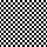
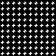


**Demo Swatch ID:** `vibrate`

```lua
EasyPattern {
    pattern = BitPattern {
        ' . . . . . . . . ',
        ' . . . . . . . . ',
        ' . . . X . . . . ',
        ' . . . X X . . . ',
        ' . X X X X X . . ',
        ' . . X X . . . . ',
        ' . . . X . . . . ',
        ' . . . . . . . . ',
    },
    duration = 1, -- must be non-zero to trigger easing function, but value doesn't matter
    scale    = 2, -- adjust to change the amplitude of vibration
    ease     = function(_, _, _, _) return math.random(0,8)/8 end, -- note that all args are ignored
}
```

> [!NOTE] The same result can also be achieved using a custom `update()` function. Check out
> [EasyPatternDemoSwatch.lua](EasyPatternDemoSwatch.lua) to see how.

### Perlin Noise

This example extends the concept introduced above, using Perlin noise to generate values which
cause the texture to animate smoothly in a seemingly random way. You could use this to create
organic effects such as rustling leaves.

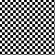
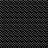


**Demo Swatch ID:** `perlin`

```lua
EasyPattern {
    pattern = BitPattern {
        ' . . . . . . . . ',
        ' . X . . . X . . ',
        ' . . . X . . . . ',
        ' . . . . . . . X ',
        ' . . . . . X . . ',
        ' . X . . . . . . ',
        ' . . . . . . . . ',
        ' . . . X . . . X ',
    },
    xDuration = 3,
    yDuration = 2, -- non-equal durations extend the total loop time, increasing apparent randomness
    xEase     = function(t, b, c, d) return b + playdate.graphics.perlin(t / d, 2, 6, 8, d, 0.75) * c end,
    yEase     = function(t, b, c, d) return b + playdate.graphics.perlin(t / d, 5, 9, 9, d, 0.75) * c end,
    scale     = 10, -- values are in the range [0,1], so we need to magnify to see the effect
}
```

### Dot Matrix

Here's one more example showcasing a custom easing function. This foregoes the continuous motion of common
easing functions for a stepwise shift between the start and end values. Adjust the constant (`4` by default)
in the easing function to change the number of steps per loop.

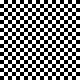
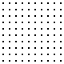


**Demo Swatch ID:** `dotmatrix`

```lua
EasyPattern {
    pattern = BitPattern {
        ' X X X X X X X X ',
        ' X X X X X X X X ',
        ' X X X X X X X X ',
        ' X X X . . X X X ',
        ' X X X . . X X X ',
        ' X X X X X X X X ',
        ' X X X X X X X X ',
        ' X X X X X X X X ',
    },
    yDuration = 1,
    yEase     = function(t, b, c, d) return playdate.easingFunctions.linear(math.floor(t*4)/4, b, c, d) end,
}
```

### Steam

This example reintroduces an alpha channel with a custom pattern. The use of adjacent white and black opaque
pixels in the pattern enables it to read against either black or white background elements.

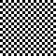
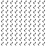


**Demo Swatch ID:** `steam`

```lua
EasyPattern {
    pattern = BitPattern {
        -- pattern --------     -- alpha ----------
        ' . . X . . X . . ',    ' . . X . X X . . ',
        ' . X . . . . . . ',    ' . X X . . . . . ',
        ' . X . . . . . . ',    ' . X X . . . . . ',
        ' . . X . . . . . ',    ' . . X X . . . . ',
        ' . . . . . . . . ',    ' . . . . . . . . ',
        ' . . . . . X . . ',    ' . . . . . X . . ',
        ' . . . . . . X . ',    ' . . . . . X X . ',
        ' . . . . . . X . ',    ' . . . . . X X . ',
    },
    duration  = 1,
    ease      = playdate.easingFunctions.inOutSine,
    yOffset   = 0.5, -- half the duration
    xReverses = true,
}
```

### Reflected Patterns

You can easily create a reflection of any pattern you've already created by setting `reflected` to true
in your pattern declaration, or on the resulting pattern once instantiated. You can reflect horizontally,
vertically, or both. This saves the hassle of having to adjust every animation parameter accordingly to
achieve the same effect. (The same convenience is also provided by the `rotated` flag, which rotates the
pattern orthogonally.)

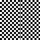
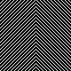


**Demo Swatch ID:** `reflected`

```lua
EasyPattern {
    ditherType = playdate.graphics.image.kDitherTypeDiagonalLine,
    bgColor    = gfx.kColorWhite,
    alpha      = 0.2,
    xDuration  = 1,
    xReflected = true, -- reflect in any axis; try drawing next to an unreflected version
}
```

### Composite Patterns

Because all patterns support transparency, you can overlay them to create more complex effects.
You can overlay an animated pattern on a static background or, as shown here, overlay two patterns with
independent animation effects. The pattern shown below is a transparent variation on ["ooze"](#ooze). It
can be drawn atop an image to add a subtle effect, or used with "ooze" as a background pattern to create
a richer, more textured animation.


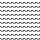
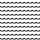

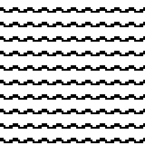
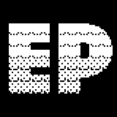

Consider how this could be used in conjunction with the provided ["waves"](waves) example, or any patterns
you create yourself.

**Demo Swatch Name:** `waterfall`

```lua
EasyPattern {
    pattern = BitPattern {
        -- pattern --------     -- alpha ----------
        ' . . . . . . . . ',    ' . . . . . . . . ',
        ' . . . . . . . . ',    ' . . . . . . . . ',
        ' . . . . . . . . ',    ' . . . . . . . . ',
        ' . . . . . . . . ',    ' . X . . . . . . ',
        ' . . . . . . . . ',    ' . . X . . . . X ',
        ' . . . . . . . . ',    ' . . . . X . X . ',
        ' . . . . . . . . ',    ' . . . . . . . . ',
        ' . . . . . . . . ',    ' . . . . . . . . ',
    },
    bgPattern = EasyPattern {
        pattern = BitPattern {
            ' X X X X X X X X ',
            ' X X X X X X X X ',
            ' X X X X X X X X ',
            ' . . X X X X X . ',
            ' X . . X X X . . ',
            ' X X . . . . . X ',
            ' X X X X X X X X ',
            ' X X X X X X X X ',
        },
        yDuration = 1,
        yReversed = true,
    },
    yDuration = 1.25,
    yReversed = true,
    yEase     = playdate.easingFunctions.inOutSine,
    yScale    = 2,
    xShift    = 2,
    alpha     = 1, -- adjust to achieve translucent results shown below
}
```

### Translucent Patterns

Consider the waterfall example just above. Now consider a situation in which a character may walk _behind_
the waterfall. You can adjust the opacity of your pattern with the `alpha` property, allowing some of the
content behind it to show through (even when the pattern itself is opaque). Unlike the above example where
a single transparent layer is shown above the image, here the entire multi-layer opaque result is dithered
to reveal the content behind.

Here's what the above pattern looks like when `alpha` is set to 0.25, 0.5, 0.75, and 1.0.

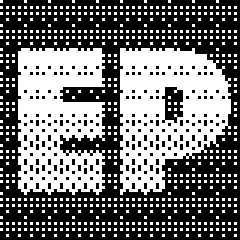

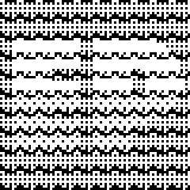


The above examples use the default dither type, but you can also change that via the `ditherType` property.
Here's what it looks like with `graphics.image.kDitherTypeDiagonalLine` instead.

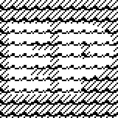

### Animated Patterns

You can also specify an `imagetable` for your pattern, enabling the pattern itself to animate, in addition
to any easing effects added by `EasyPattern`. First, here's what that looks like without any easing applied.
Note the `tickDuration`, which indicates how long to display each frame in the sequence:

**Demo Swatch Name:** `dashing`

```lua
EasyPattern {
    pattern = gfx.imagetable.new("images/hdashes"),
    tickDuration = 1/16,
}
```


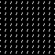


You can add easing to the overall pattern to amplify its effects:

```lua
EasyPattern {
    pattern = gfx.imagetable.new("images/hdashes"),
    tickDuration = 1/8,
    xDuration = 2,
    ease = playdate.easingFunctions.outExpo,
    reverses = true,
    scale = 6,
},
```


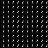


### Self-Mutating Patterns

You can set functions to be called when the pattern loops in the X axis, Y axis, or overall in order
to adjust the pattern itself or trigger other effects in sync with its movement. This example adds X and Y
loop callbacks to the previous [Circular Pan](#circular-pan) example, adjusting the scale with each cycle in
order to spiral outward then inward again repeatedly.


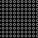


**Demo Swatch Name:** `circle` (copy/paste the loop callbacks below and set the starting scale to 1)

```lua
EasyPattern {
    pattern = BitPattern {
        ' X X X X X X X X ',
        ' X X . . . X X X ',
        ' X . X X X . X X ',
        ' X . X X X . X X ',
        ' X . X X X . X X ',
        ' X X . . . X X X ',
        ' X X X X X X X X ',
        ' X X X X X X X X ',
    },
    duration  = 1,
    ease      = playdate.easingFunctions.inOutSine,
    xOffset   = 0.5, -- half the duration
    reverses  = true,
    scale     = 1,
    xLoopCallback = function(pttrn, n)
        pttrn.xScale += n//5%2 == 0 and 1 or -1
    end,
    yLoopCallback = function(pttrn, n)
        pttrn.yScale += n//5%2 == 0 and 1 or -1
    end,
},
```

### Dynamic Patterns

Lastly, you can set an `update()` function on your pattern that gets called every time new phases are calculated.
This function is passed the `EasyPattern` itself as well as the current time, and allows you to modify the pattern
based on any inputs or game conditions you wish. This is a simple example that modifies the
["Conveyor Belt"](#conveyor-belt) above, allowing it to be operated with the crank.


**Demo Swatch Name:** `conveyor` (adjust the commented lines to modify the original example)

```lua
EasyPattern {
    pattern    = {
        ditherType = playdate.graphics.image.kDitherTypeHorizontalLine,
        alpha = 0.25,
    },
    bgColor    = playdate.graphics.kColorWhite,
    update     = function(p) p.yShift = playdate.getCrankPosition()//15 end,
}
```

## Demo Swatch

The included [EasyPatternDemoSwatch.lua](EasyPatternDemoSwatch.lua) provides a quick way to try a
demo of `EasyPattern` in your own project. Just drop the file into your project next to `EasyPattern.lua`,
include it in `main.lua`, and create an instance by specifying the ID of the pattern as listed above.

```lua
local swatch = EasyPatternDemoSwatch("waves")
```

Alternatively, you can quickly tile the full set of examples on screen:

```lua
EasyPatternDemoSwatch.tile()
```

## Defining Your Patterns

A variety of tools exist to help you find or create patterns you could use with EasyPattern. For
instance, [GFXP](https://dev.playdate.store/tools/gfxp/) provides a library of patterns, a
visual pattern editor, and a tool for viewing patterns on Playdate hardware.

You can specify your patterns in hex as shown in the examples above. Or, for a more direct
visual representation in your code, you can use a binary encoding as shown below.

```lua
EasyPattern {
    pattern = BitPattern {
        '11110000',
        '11100001',
        '11000011',
        '10000111',
        '00001111',
        '00011110',
        '00111100',
        '01111000',
    },
    -- animation properties…
}
```

`BitPattern` is included when you import `EasyPattern` so you can use it at your convenience.
You can also include an alpha channel for your pattern. `BitPattern` automatically swizzles the
inputs, enabling you to place the pattern and its alpha channel side by side in a compact and legible
format, like so:

```lua
EasyPattern {
    pattern = BitPattern {
        -- PTTRN        ALPHA
        '10101010',  '00010000',
        '01010101',  '00111000',
        '10101010',  '01111100',
        '01010101',  '11111110',
        '10101010',  '01111100',
        '01010101',  '00111000',
        '10101010',  '00010000',
        '01010101',  '00000000',
    },
    -- animation properties…
}
```

For additional convenience, BitPattern also accepts ASCII representations of these strings:

- Use `0`, `.`, or `_` for black/transparent pixels
- Use `1`, `X`, or any other non-black-pixel character for white/opaque pixels
- Add spaces between pixels to aid legibility, if desired.

Here's the same pattern shown above in a more legible form:

```lua
BitPattern {
    -- PTTRN ----------   -- ALPHA ---------
    ' X . X . X . X . ',  ' . . . X . . . .',
    ' . X . X . X . X ',  ' . . X X X . . .',
    ' X . X . X . X . ',  ' . X X X X X . .',
    ' . X . X . X . X ',  ' X X X X X X X .',
    ' X . X . X . X . ',  ' . X X X X X . .',
    ' . X . X . X . X ',  ' . . X X X . . .',
    ' X . X . X . X . ',  ' . . . X . . . .',
    ' . X . X . X . X ',  ' . . . . . . . .',
}
```

## Troubleshooting

### What if my pattern doesn't appear?

Make sure you've specified the `pattern` parameter properly. More info on
[defining your patterns](#defining-your-patterns) is provided in the previous section.

### What if my pattern doesn't animate?

1. First, make sure you've specified an `xDuration` and/or `yDuration`, without which your pattern
   will remain static.
2. Ensure that `draw()` gets called as necessary to reflect the rendered pattern. If you're using a
   sprite, you can call `self:markDirty()` from your `update()` function. See the
   [notes on performance](#what-about-performance) to optimize drawing. If you're not using sprites,
   just be sure to call your draw method as needed each frame.

## What About Performance?

Playdate is a very capable device, but even relatively simple Lua programs can suffer from
performance issues without adequate optimization. EasyPattern should work reliably in moderation
for most games, and does have some built-in optimizations. Most notably, you can ensure that
your sprite is only redrawn on frames when the pattern actually updates by checking whether it's
dirty first:

```lua
-- only redraw the sprite when the pattern updates
if myEasyPattern:isDirty() then
    self:markDirty()
end

```

When `isDirty()` is called, `EasyPattern` will compute the phase offsets for the current time and
determine whether they have changed since the pattern was last applied. It also caches those
values so that they can be used when you do call `apply()`, avoiding the need to compute them twice
in a single frame. The caching also ensures that there's no performance hit for calling
`apply()` more than once in a given frame, so you can set the pattern multiple times in your draw
function as needed, or reuse the same pattern across several sprite instances with no penalty.

This demonstration illustrates how patterns update only as needed. The orange flashes indicate the
regions of the screen that are redrawn each frame (toggle in the Simulator under the **View** menu).
Note how each pattern updates on different intervals (even non-regular ones) as needed when the
rendered phase of the pattern changes.


With all of that said, EasyPattern is certainly not the _best_ approach to animated patterns for
performance given the need to calculate phase offsets each frame. If you need maximal performance
you should consider encoding each frame of the animated pattern in an `imagetable` instead. If
you're using EasyPattern to draw sprites and need more performance, you can also use the
[Roto](https://github.com/ebeneliason/roto) utility to export the pattern or the final rendered
sprite(s) as matrix `imagetable` images.

## License

EasyPattern is distributed under the terms of the [MIT License](https://spdx.org/licenses/MIT.html).
