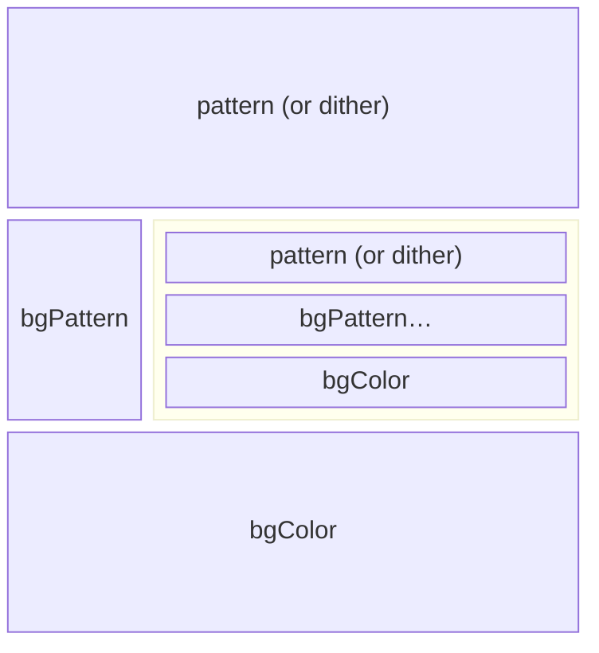
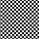
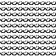

# EasyPattern

[](LICENSE) [](https://toyboxpy.io) [](https://github.com/ebeneliason/easy-pattern/tags)

_Easy animated patterns for Playdate._


## What is EasyPattern?

EasyPattern is a utility for use with the [Playdate](https://play.date/) SDK that provides a
simple declarative syntax for creating animated patterns. Specify an 8x8 pattern sequence and
any of a variety of easing parameters, and let EasyPattern take care of the rest. Under the
hood it will automatically phase shift your pattern in the horizontal and/or vertical axes to
create a seamless looping pattern texture that can be used with any
[PlayDate drawing calls](https://sdk.play.date/3.0.1/Inside%20Playdate.html#_drawing).

_Playdate is a registered trademark of [Panic](https://panic.com)._

### Table of Contents

1. [Installation](#installation)
2. [Basic Usage](#basic-usage)
3. [Pattern Gallery](#gallery)
4. [Understanding EasyPattern](#understanding-easypattern)
5. [Parameter Reference](#supported-parameters)
6. [Function Reference](#functions)
7. [Examples](#examples)
8. [Demo Swatch](#demo-swatch)
9. [Defining Patterns](#defining-your-patterns)
10. [Troubleshooting & Performance](#troubleshooting)

## Installation

### Installing Manually

1.  Download the [EasyPattern.lua](EasyPattern.lua) file.
2.  Place the file in your project directory (e.g. in the `source` directory next to `main.lua`).
3.  Import it in your project.

    ```lua
    import "EasyPattern"
    ```

### Installing with Toybox

1.  If you haven't already, download and install [`toybox.py`](https://code.malenfant.net/didier/toybox.py).

2.  Add EasyPattern to your project directory:

    ```console
    toybox add ebeneliason/easy-pattern
    toybox update
    ```

3.  Then, if your code is in the `source` directory, import it as follows:

    ```lua
    import '../toyboxes/toyboxes.lua'
    ```

## Basic Usage

### Define Your Pattern

Create an EasyPattern using a simple declarative syntax:

```lua
local checkerboard <const> = { 0xF0, 0xF0, 0xF0, 0xF0, 0x0F, 0x0F, 0x0F, 0x0F }
local easyCheckerboard = EasyPattern {
    pattern  = checkerboard,
    duration = 1.0,
    ease     = playdate.easingFunctions.inOutCubic,
    -- <additional animation params here>
}
```

See the docs for [`init()`](#initparams) and the [list of supported parameters](#supported-parameters).

### Draw With Your Pattern

Set the pattern for drawing with [`apply()`](#apply) (e.g. in your sprite's `draw()` function):

```lua
playdate.graphics.setPattern(easyCheckerboard:apply())
-- draw with your pattern here, using any of the SDKs drawing APIs
```

That's it! The pattern will automatically animate according to the parameters provided. If using
sprites, make sure your sprite has a chance to draw in order to animate the pattern (see below).

### Detect Changes in Your Pattern

You'll need to redraw whenever your pattern changes, but you'll also want to avoid redrawing when
you don't need to. Depending on the speed of your animation, chances are the pattern won't actually
update every frame. You can check to see whether the phase values for the pattern have changed with
[`isDirty()`](#isdirty) in order to know when to redraw. If using sprites, you can mark them dirty when the
pattern changes in your sprite's `update()` function:

```lua
if myEasyPattern:isDirty() then
    self:markDirty()
end
```

## Gallery

Click on any pattern to jump to a complete example with code, or use the provided
[demo swatch](#demo-swatch) to easily try them out for yourself.

[](#conveyor)
[](#scanline)
[](#ooze)
[](#marching-ants)
[](#vertical-bounce)
[](#waves)
[](#circular-pan)
[](#sway)
[](#vibrate)
[](#perlin-noise)
[](#dot-matrix)
[](#steam)
[](#reflected-patterns)
[](#composite-patterns)

## Understanding EasyPattern

EasyPatterns can be thought of in two parts:

1. **Pattern**: A collection of properties that define its overall appearance
2. **Animation**: A collection of properties that define its overall behavior

This section provides context for each of these to help you understand how EasyPattern works, which in turn
will help you reason about how to construct your patterns. The pattern properties converge to define an 8x8
pixel pattern, and the animation properties converge to define the phase offsets for the pattern in each axis
at the given point in time. These converged values are returned by each call to [`apply()`](#apply), enabling
you to pass them directly to `playdate.graphics.setPattern()` and draw using the animated pattern.

### Types and Compatibility

The types of the core pattern and animation properties match those used elsewhere in the Playdate
SDK to maximize compatibility.

- All easing functions are defined in the
  [`playdate.easingFunctions`](https://sdk.play.date/3.0.1/Inside%20Playdate.html#M-easingFunctions) format. You
  can use these functions directly, specify custom functions of your own, or use another library.
- All patterns are defined either as a `ditherType` (as would be passed to
  [`playdate.graphics.setDitherPattern`](https://sdk.play.date/3.0.1/Inside%20Playdate.html#f-graphics.setDitherPattern)),
  or an 8x8 pixel pattern as an array of 8 numbers describing the bitmap for each row (as would be passed
  to [playdate.graphics.setPattern](https://sdk.play.date/3.0.1/Inside%20Playdate.html#f-graphics.setPattern)). See
  [Defining Your Patterns](#defining-your-patterns) for more details and tools to help you specify patterns easily.

### Animation Timing

EasyPatterns are designed to loop continuously. They do so with respect to an absolute clock that
starts the moment the program runs (specifically `playdate.getCurrentTimeMilliseconds()`). _They do not depend on
timers._ Instead, the appropriate axis phase shifts for the current point in time are computed in closed-form based
on the system clock and the animation properties for each axis.

> [!NOTE]
> This approach means that two instances of the same EasyPattern will run in sync with each other regardless
> of when they were initialized or any other timing conditions. If you'd like two of the same EasyPatterns
> (or two different patterns with the same duration) to animate out of phase with each other, adjust the `xOffset`
> and/or `yOffset` for one of them.

To understand how these properties affect the animation, let's look at how the phase is computed at a given
point in time:

```lua
-- assuming time t, ease ~= nil, and duration > 0...
local tx = (t * self.xSpeed + self.xOffset) % self.xDuration
local xPhase = self.xEase(tx, 0, PTTRN_SIZE, self.xDuration, table.unpack(self.xEaseArgs)) * self.xScale % PTTRN_SIZE // 1
```

First, note the time scaling. `tx` is computed based on the current time `t` by scaling it by `xSpeed` (thus slowing
or speeding up time), adding the `xOffset` (thus offsetting the start time), and then modding by `xDuration` (so the
value passed to the easing function is always in the range [0, `xDuration`]).

The adjusted time value is then passed to the specified easing function, which then interpolates between 0 and 8
(`PTTRN_SIZE`) over the specified `xDuration`. That result is then multiplied by `xScale` to amplify the phase
shift (for example, setting `xScale` to 2 will cause the pattern to move 16px per loop). Lastly, the result is
integer-divided by 1 to truncate the final phase to an integer value.

You can also define other properties that affect the final animation in addition to those that define core timing:

- **Reverses**: Set the [`xReverses`](#xreverses) or [`yReverses`](#yreverses) properties to cause the animation to
  reverse directions at each end. The `xReversed` boolean property will flip with each reversal.
- **Reversed**: Set the [`xReversed`](#xreversed) or [`yReversed`](#yreversed) to cause the animation to run in the
  opposite direction. This may be used with or without "reverses".

### Pattern Composition

EasyPatterns support several parameters representing distinct layers—all of which support transparency—
that get composited to create the final pattern. This diagram describes their order. Because the `bgPattern`
property may be set to another `EasyPattern` instance, it's possible to create recursive stacks which
compose several patterns together as one.

**↑ TOP**



**↓ BOTTOM**

> [!NOTE]
> The current fully-composited pattern image is accessible via the `patternImage` property. Note that this image
> represents the raw pattern, before any phase shifts have been applied. However, you should rarely need to access
> this—it's easiest to draw with your pattern by calling [`apply()`](#apply).

### Pattern Transformation

You can also define other properties to affect the final composited pattern in addition to those that define
its layers. For example:

- **Reflection**: Set the [`xReflected`](#xreflected) and [`yReflected`](#yreflected) properties to mirror the
  fully-composited pattern in the horizontal and vertical axes, respectively.
- **Rotation**: Set the [`rotated`](#rotated) property to rotate the fully-composited pattern by 90º, producing
  an orthogonal result.
- **Translation/Phase**: Set the [`xShift`](#xshift) and [`yShift`](#yshift) properties to additively adjust
  the phase offsets of the pattern in each axis. This can be used to make patterns respond dynamically to
  inputs or game states, as described in [`setPhaseShifts`](#setphaseshiftsxshift-yshift).
- **Inversion**: Set the [`inverted`](#inverted) property to cause all white pixels to appear black, and vice-versa.

## Supported Parameters

A full list of supported parameters follows below. Pass a single table containing one or more of these
parameters to [`init()`](#initparams) to define your pattern. Technically speaking, none of these are required.
In practice, you'll want to set either [`pattern`](#pattern) or [`ditherType`](#dithertype), and a
[`duration`](#xDuration) for at least one axis as shown in the basic usage example above.

Parameters are grouped into the following categories:

1. [Pattern Parameters](#pattern-parameters): Define the overall appearance of your pattern.
2. [Animation Parameters](#animation-parameters): Define the animation behaviors of your pattern.
3. [Transformation Parameters](#transformation-parameters): Apply simple transformations to your pattern,
   such as translation, reflection, and rotation.
4. [Callback Parameters](#callback-parameters): Set functions to be called when the pattern loops.

The [animation](#animation-parameters), [transformation](#transformation-parameters), and
[callback](callback-parameters) parameters may also be set directly on your `EasyPattern` instance at any
time after initialization, e.g.

```lua
easyCheckerboard.xDuration = 0.5
```

### Pattern Parameters

#### `pattern`

The pattern to animate, specified as an array of 8 numbers describing the bitmap for each row, with
an optional additional 8 for a bitmap alpha channel, as would be supplied to
`playdate.graphics.setPattern()`. See [Defining Your Patterns](#defining-your-patterns) for details
on how to construct valid arguments for this parameter.

Default: `nil`

#### `ditherType`

A dither type as would be passed to `playdate.graphics.setDitherPattern()`, e.g.
`playdate.graphics.image.kDitherTypeVerticalLine`. This setting only applies when the `pattern`
parameter is omitted or `nil`.

Default: `nil`

#### `alpha`

An alpha value for a dither pattern, which can either be the default Playdate dither effect, or one
specified by `ditherType`. This setting only applies when the `pattern` parameter is omitted or `nil`.

Default `0.5`

#### `color`

The color in which to draw the provided dither pattern. This setting only applies when the `pattern`
parameter is omitted or `nil`.

Default: `playdate.graphics.kColorBlack`

#### `bgColor`

The color to use as a background when rendering a dither pattern (or a pattern with an alpha channel,
although in that case the background color could be baked into the pattern itself, without alpha).
Patterns are rendered with transparency by default, but this can be used to make them opaque.

Default: `playdate.graphics.kColorClear`

#### `bgPattern`

A pattern to render behind the this one. This may be a static pattern of the type provided for the `pattern`
parameter, or another `EasyPattern` instance.

Default: `nil`

#### `inverted`

A boolean indicating whether the pattern is inverted, with any white pixels appearing black, and any black
pixels appearing white. Inverting the pattern does not affect the alpha channel.

Default: `false`

### Animation Parameters

#### `xEase`

An easing function that defines the animation pattern in the X axis. The function should follow the
signature of the [`playdate.easingFunctions`](https://sdk.play.date/3.0.1/Inside%20Playdate.html#M-easingFunctions):

- **`t`**: elapsed time, in the range [0, `duration`]
- **`b`**: the beginning value (always 0)
- **`c`**: the change in value (always 8 — the size of the pattern)
- **`d`**: the duration (`duration`)

Default: `playdate.easingFunctions.linear`

#### `yEase`

An easing function that defines the animation pattern in the Y axis. The function should follow the
signature of the `playdate.easingFunctions` as described just above.

Default: `playdate.easingFunctions.linear`

#### `xEaseArgs`

A list containing any additional arguments to the X axis easing function, e.g. to parameterize
amplitude, period, overshoot, etc.

Default: `{}`

#### `yEaseArgs`

A list containing any additional arguments to the Y axis easing function, e.g. to parameterize
amplitude, period, overshoot, etc.

Default: `{}`

#### `xDuration`

The duration of the animation in the X axis, in seconds. Omit this parameter or set it to 0 to
prevent animation in this axis.

Default: `0`

#### `yDuration`

The duration of the animation in the Y axis, in seconds. Omit this parameter or set it to 0 to
prevent animation in this axis.

Default: `0`

#### `xOffset`

An absolute time offset for the X axis animation (relative to Y), in seconds.

Default: `0`

#### `yOffset`

An absolute time offset for the Y axis animation (relative to X), in seconds.

Default: `0`

#### `xReverses`

A boolean indicating whether the X axis animation reverses at each end.

Default: `false`

#### `yReverses`

A boolean indicating whether the Y axis animation reverses at each end.

Default: `false`

#### `xReversed`

A boolean indicating whether the X axis animation is playing in reverse. This may be set manually,
and also updates automatically when `xReverses` is `true`.

Default: `false`

#### `yReversed`

A boolean indicating whether the Y axis animation is playing in reverse. This may be set manually,
and also updates automatically when `yReverses` is `true`.

Default: `false`

#### `xSpeed`

A multiplier for the overall speed of the animation in the X axis, relative to the timings
specified for its duration and offset.

Default: `1`

#### `ySpeed`

A multiplier for the overall speed of the animation in the Y axis, relative to the timings
specified for its duration and offset.

Default: `1`

#### `xScale`

A multiplier describing the number of 8px repetitions the pattern moves by per duration cycle in
the X axis. Non-integer values may result in discontinuity when looping.

Default: `1`

#### `yScale`

A multiplier describing the number of 8px repetitions the pattern moves by per duration cycle in
the Y axis. Non-integer values may result in discontinuity when looping.

Default: `1`

### Transformation Parameters

#### `xShift`

The number of pixels to shift the final pattern phase by in the X axis.

Default: `0`

#### `yShift`

The number of pixels to shift the final pattern phase by in the Y axis.

Default: `0`

#### `xReflected`

A boolean indicating whether the entire pattern should be reflected across the vertical (Y) axis.

Default: `false`

#### `yReflected`

A boolean indicating whether the entire pattern should be reflected across the horizontal (X) axis.

Default: `false`

#### `rotated`

A boolean indicating whether the entire pattern should be rotated 90º, producing an orthogonal result.
Rotation is applied following any reflections.

Default: `false`

### Callback Parameters

> [!NOTE]
> Because EasyPattern does not use timers nor have an update function that gets called each frame, these
> callbacks trigger lazily the when the pattern crosses a loop boundary while computing new phase offsets
> (such as when checking `isDirty()`, or when calling `apply()`). If you check for dirty and/or draw using
> your pattern each frame, you can ignore this fact. If you do not, then be aware that:
>
> 1. The time between loop callbacks may not be exact, especially if the frame rate is lower.
> 2. EasyPattern callbacks will not be called at all if the pattern is not being used.

#### `loopCallback`

A function to be called when the pattern loops, taking into account the effective duration of the animation
in each axis including speed and reversal, as well as any animated background pattern. The `EasyPattern` and
total loop count are passed as parameters to the function.

```lua
myEasyPattern.loopCallback = function(p, n)
  print("Looped " .. n .. " times!", p)
end
```

Default: `nil`

#### `xLoopCallback`

A function to be called when the pattern loops in the X axis, taking into account speed and reversal, as
well as any background pattern. The `EasyPattern` and X loop count are passed as parameters to the function.

Default: `nil`

#### `yLoopCallback`

A function to be called when the pattern loops in the Y axis, taking into account speed and reversal, as
well as any background pattern. The `EasyPattern` and Y loop count are passed as parameters to the function.

Default: `nil`

## Functions

### Core

#### `init([params])`

EasyPattern takes a single argument — a table of [named parameters](#supported-parameters) that define
both the pattern and animation properties. (This is also why no parentheses are required when defining
a new instance, instead enabling use of `{` and `}` by themselves.)

Most parameters come in pairs to enable setting independent values for the X and Y axes. For
example, `xDuration` and `yDuration`. However, when initializing a new `EasyPattern`, any
of the axis-specific values may be set for both axes at once by dropping the `x` or `y` prefix
from the parameter name, e.g. `duration = 1, scale = 2, reverses = true, ...` and so on. For example:

```lua
local myEasyPattern = EasyPattern {
  pattern   = { 0xF0, 0xF0, 0xF0, 0xF0, 0x0F, 0x0F, 0x0F, 0x0F }, -- checkerboard
  duration  = 1,
  yEase     = playdate.easingFunctions.inOutSine,
  yReverses = true,
}
```

#### `apply()`

_This is where the magic happens._ `apply()` takes no arguments and returns a 3-tuple matching the
signature of `playdate.graphics.setPattern()`. This enables you to pass the result of a call to
`apply` directly to the `setPattern()` function without intermediate storage in a local variable:

```lua
gfx.setPattern(myPattern:apply())
-- draw using your pattern…
```

**Returns:**

- **`patternImage`:** A `playdate.graphics.image` containing the 8x8 pattern to be drawn.
- **`xPhase`:** The calculated phase offset for the X axis given the current time and other
  animation properties.
- **`yPhase`:** The calculated phase offset for the Y axis given the current time and other
  animation properties.

#### `isDirty()`

Indicates whether the pattern needs to be redrawn based on a change in the phase values since the
last time `apply()` was called. In practice, this means you can check to see if the pattern is dirty
in `update()` and call `markDirty()` on your sprite to ensure `draw()` gets called that frame. This
will work no matter how many sprites use the same pattern for drawing.

```lua
-- e.g. in `sprite:update()`
if myPattern:isDirty() then
  self:markDirty()
end
```

**Returns:**

- **`dirty`**: A boolean indicating whether the pattern needs to be redrawn.

#### `getPhases()`

Used to introspect the current X and Y phase offsets for the pattern. If the values are stale,
new values will be computed when calling this function; otherwise, the cached values will be
returned instead.

**Returns:**

- **`xPhase`**: A number representing the current phase offset for the X axis in the range 0..7.
- **`yPhase`**: A number representing the current phase offset for the Y axis in the range 0..7.
- **`recomputed`**: A boolean indicating whether the values were newly computed.

### Pattern

#### `setPattern(pattern)`

Sets a new pattern, retaining all animation properties.

**Params:**

- **`pattern`:** An array of 8 numbers describing the bitmap for each row, with an optional
  additional 8 for a bitmap alpha channel, as would be supplied to
  `playdate.graphics.setPattern()`.

#### `setDitherPattern(alpha, [ditherType])`

Sets a new dither pattern, retaining all animation properties. Calling this function will
implicitly set `pattern` to `nil`.

**Params:**

- **`alpha`:** A value in the range [0, 1] describing the opacity of the dither effect.
- **`ditherType`:** (_optional_) A constant as would be passed to `playdate.graphics.setDitherPattern()`, e.g.
  `playdate.graphics.image.kDitherTypeVerticalLine`.

#### `setColor(color)`

Sets the color used for drawing the dither pattern.

**Params:**

- **`color`:** A `playdate.graphics` color value.

#### `setBackgroundColor(color)`

Sets the background color used for drawing the dither pattern.

**Params:**

- **`color`:** A `playdate.graphics` color value.

#### `setBackgroundPattern(pattern)`

Sets a background pattern which gets rendered behind this one. Setting a background pattern is substantially
more performant than drawing one pattern atop another, as only the 8x8 pattern gets composited (and only frames
when it changes). All other drawing is only done once.

Given that you can set another `EasyPattern` as a background, you can also create chains to compose 3 or more
patterns and achieve more complex interference effects.

**Params:**

- **`pattern`:** The background pattern, either in the same form as that provided to `setPattern`, or another
  `EasyPattern` instance. Although you cannot specify a dither pattern as a background, you can achieve the same
  result by providing an `EasyPattern` with a dither pattern and a duration of 0 (to prevent animation).

#### `setInverted(flag)`

Inverts the resulting pattern, causing any white pixels to appear black and any black pixels to appear white.
The alpha channel is not affected.

**Params:**

- **`flag`:** A `boolean` indicating whether the pattern is inverted.

## Transformation

#### `setPhaseShifts(xShift, [yShift])`

Sets the X and Y phase shift values. If `yShift` is omitted, both X and Y phases are set to the same value.
These phase shifts are _additive_ to (rather than override) any shifts in phase resulting from the animation
parameters applied to your pattern.

This can be used to enable dynamic pattern behaviors driven by external game logic. Here are
a few examples:

1. A conveyor belt pattern which animates according to the crank speed
2. A landscape pattern (e.g. platforms, trees) that's shifted a bit for each instance to help them appear
   as distinct entities even though they share the same pattern
3. A parallax effect, which shifts the animated pattern laterally as the player moves left and right

The image below illustrates one such application. The phases of the `EasyPattern` applied to the ball
are shifted dynamically based on the ball's velocity. This creates the illusion that the ball is rolling
and spinning as it travels down the lane.


**Params:**

- **`xShift`:** The phase shift to set for the X axis
- **`yShift`:** The phase shift to set for the Y axis

Note that these values may also be set directly on an `EasyPattern` instance. However, calling this function
ensures that the resulting phase values are correct immediately, rather than lazily computed the next time
the pattern is applied.

**Returns:**

- **`dirty`**: A boolean indicating whether the set caused the phase values to update.

#### `shiftPhasesBy(xShift, [yShift])`

A convenience function that sets the phase shifts by offsetting them by the specified amount from their
current values. If `yShift` is omitted, both X and Y phases are shifted the same amount.

**Params:**

- **`xShift`:** The amount to to shift the phase by in the X axis
- **`yShift`:** The amount to to shift the phase by in the Y axis

**Returns:**

- **`dirty`**: A boolean indicating whether the shift caused the phase values to update.

#### `setReflected(horizontal, [vertical])`

Sets the `xReflected` and `yReflected` properties indicating in which axes the pattern should be inverted.
If the second argument is omitted, both axes are set to the same value.

**Params:**

- **`horizontal`:** A `boolean` indicating whether the pattern is reflected horizontally across the Y axis.
- **`horizontal`:** A `boolean` indicating whether the pattern is reflected vertically across the X axis.

#### `setRotated(flag)`

Sets the `rotated` property, indicating whether the pattern should be rotated 90º to produce an
orthogonal result.

**Params:**

- **`flag`:** A boolean indicating whether the pattern is rotated.

### Looping

#### `getLoopDuration()`

Returns the total effective loop duration of the pattern in seconds, taking into account the duration of
the animation in each axis including speed and reversal, as well as any background pattern.

#### `getXLoopDuration()`

Returns the total effective loop duration of the pattern in the X axis in seconds, taking into account its
speed and reversal as well as any background pattern.

#### `getYLoopDuration()`

Returns the total effective loop duration of the pattern in the Y axis in seconds, taking into account its
speed and reversal as well as any background pattern.

## Examples

These examples demonstrate the range of pattern animations possible with EasyPattern. Each
is shown with a standard checkerboard pattern to compare the easing effect, and with a custom
pattern intended to illustrate a potential application.

You can try these examples yourself using the included [EasyPatternDemoSwatch](EasyPatternDemoSwatch.lua).
[See below](#demo-swatch) for instructions, as well as docs for [BitPattern](#defining-your-patterns) which enables the ASCII pattern representations seen in these examples.

### Conveyor Belt

This example utilizes the built-in vertical line dither type to create a simple horizontally
scrolling conveyor belt effect. Because the dither effect naturally has transparency, a
`bgColor` is specified so that the resulting belt pattern is fully opaque. Achieve belt effects
moving in different directions by either:

1. Specifying the horizontal dither type and `reversed` as needed
2. Using a combination of `reflected` and `rotated` to reorient the pattern


**Demo Swatch ID:** `conveyor`

```lua
EasyPattern {
    ditherType = playdate.graphics.image.kDitherTypeVerticalLine,
    duration   = 0.5,
    bgColor    = playdate.graphics.kColorWhite
}
```

### Scanline

This example utilizes the built-in horizontal line dither, including transparency, to create a simple
scanline effect. This could be used atop an image or rendered scene to simulate an old monitor.


**Demo Swatch ID:** `scanline`

```lua
EasyPattern {
    ditherType = playdate.graphics.image.kDitherTypeHorizontalLine,
    color      = gfx.kColorWhite,
    alpha      = 0.8,
    duration   = 0.5,
    yReversed  = true,
}
```

### Ooze

Adding a custom pattern to a default linear ease in the vertical axis produces imagery
that evokes landscapes such as a waterfall, sand dunes, lava, or gooey ooze.

 


**Demo Swatch ID:** `ooze`

```lua
ooze = EasyPattern {
    pattern = BitPattern {
        ' X X X X X X X X ',
        ' X X X X X X X X ',
        ' X X X X X X X X ',
        ' . . X X X X X . ',
        ' X . . X X X . . ',
        ' X X . . . . . X ',
        ' X X X X X X X X ',
        ' X X X X X X X X ',
    },
    yDuration = 1,
    yReversed = true,
},
```

### Marching Ants

This example creates a "marching ants" dotted outline effect, as is often used to indicate
rectangular selections. To achieve the effect, use this pattern in conjunction with a call
to `drawRect(r)`. Modulate the length of the dashes with the `alpha` parameter.


**Demo Swatch ID:** `ants`

```lua
EasyPattern {
    ditherType = playdate.graphics.image.kDitherTypeDiagonalLine,
    xDuration  = 0.25,
    bgColor    = playdate.graphics.kColorWhite
}
```

### Vertical Bounce

In this example, the pattern appears to fall downward one block at a time, bouncing to a
settled state before the next row drops out. The `scale` parameter is used to exaggerate
the effect, causing it to fall by multiple rows per cycle.


**Demo Swatch ID:** `bounce`

```lua
EasyPattern {
    pattern = BitPattern {
        ' . . . . . . . . ',
        ' X X X . X X X X ',
        ' X X X . X X X X ',
        ' X X X . X X X X ',
        ' . . . . . . . . ',
        ' X X X X X X X . ',
        ' X X X X X X X . ',
        ' X X X X X X X . ',
    },
    yDuration = 1,
    yEase     = playdate.easingFunctions.outBounce,
    yReversed = true,
    scale     = 2,
}
```

### Waves

This example uses a sinusoidal ease in the vertical axis to create a simple wave motion, paired
with a linear ease in the horizontal axis to illustrate directional flow. You can combine
different easing functions and even different timing values for each axis to achieve more nuanced
effects.


**Demo Swatch ID:** `waves`

```lua
EasyPattern {
    pattern = BitPattern {
        ' . . . . . . . . ',
        ' . X . . . . . X ',
        ' . . . X . X . . ',
        ' . . . . . . . . ',
        ' . . . . . . . . ',
        ' X X X X . . . . ',
        ' . . . . X X X X ',
        ' . . . . . . . . ',
    },
    xDuration = 0.5,
    yDuration = 1.0,
    yEase     = playdate.easingFunctions.inOutSine,
    yReverses = true,
}
```

### Circular Pan

This example makes use of built-in sine functions and an `xOffset` to create a continuous
circular panning movement.


**Demo Swatch ID:** `circle`

```lua
EasyPattern {
    pattern = BitPattern {
        ' X X X X X X X X ',
        ' X X . . . X X X ',
        ' X . X X X . X X ',
        ' X . X X X . X X ',
        ' X . X X X . X X ',
        ' X X . . . X X X ',
        ' X X X X X X X X ',
        ' X X X X X X X X ',
    },
    duration  = 1,
    ease      = playdate.easingFunctions.inOutSine,
    xOffset   = 0.5, -- half the duration
    reverses  = true,
    scale     = 3,
}
```

### Sway

This example shows how changing a few parameters can create substantially different effects.
Subtle adjustments to the above example yield a gentle swaying motion.


**Demo Swatch ID:** `sway`

```lua
EasyPattern {
    pattern = BitPattern {
        ' X X X X X X X X ',
        ' X X X X X X X X ',
        ' X X X X . X X X ',
        ' . X X X X X X X ',
        ' . . X X X X X . ',
        ' . X . X X X . X ',
        ' X . X . . . X . ',
        ' X X . X . X . X ',
    },
    xDuration = 2,
    yDuration = 1, -- half the x duration
    ease      = playdate.easingFunctions.inOutSine,
    reverses  = true,
    yReversed = true,
    xScale    = 3,
}
```

### Vibrate

This example introduces a custom easing function for more complex behavior. Technically, it's
not an _easing_ function at all. It ignores the easing parameters in favor of returning a random
offset value. This yields a jittery vibration effect evocative of high energy or volatility.

You can create any type of custom function you like to design behaviors unique to your application.


**Demo Swatch ID:** `vibrate`

```lua
EasyPattern {
    pattern = BitPattern {
        ' . . . . . . . . ',
        ' . . . . . . . . ',
        ' . . . X . . . . ',
        ' . . . X X . . . ',
        ' . X X X X X . . ',
        ' . . X X . . . . ',
        ' . . . X . . . . ',
        ' . . . . . . . . ',
    },
    duration = 1, -- must be non-zero to trigger easing function, but value doesn't matter
    scale    = 2, -- adjust to change the amplitude of vibration
    ease     = function(t, b, c, d) return math.random(0, 5) / 5 end,
}
```

### Perlin Noise

This example extends the concept introduced above, using Perlin noise to generate values which
cause the texture to animate smoothly in a seemingly random way. You could use this to create
organic effects such as rustling leaves.


**Demo Swatch ID:** `perlin`

```lua
EasyPattern {
    pattern = BitPattern {
        ' . . . . . . . . ',
        ' . X . . . X . . ',
        ' . . . X . . . . ',
        ' . . . . . . . X ',
        ' . . . . . X . . ',
        ' . X . . . . . . ',
        ' . . . . . . . . ',
        ' . . . X . . . X ',
    },
    xDuration = 3,
    yDuration = 2, -- non-equal durations extend the total loop time, increasing apparent randomness
    xEase     = function(t, b, c, d) return b + playdate.graphics.perlin(t / d, 2, 6, 8, d, 0.75) * c end,
    yEase     = function(t, b, c, d) return b + playdate.graphics.perlin(t / d, 5, 9, 9, d, 0.75) * c end,
    scale     = 10, -- values are in the range [0,1], so we need to magnify to see the effect
}
```

### Dot Matrix

Here's one more example showcasing a custom easing function. This foregoes the continuous motion of common
easing functions for a stepwise shift between the start and end values. Adjust the constant (`4` by default)
in the easing function to change the number of steps per loop.


**Demo Swatch ID:** `dotmatrix`

```lua
EasyPattern {
    pattern = BitPattern {
        ' X X X X X X X X ',
        ' X X X X X X X X ',
        ' X X X X X X X X ',
        ' X X X . . X X X ',
        ' X X X . . X X X ',
        ' X X X X X X X X ',
        ' X X X X X X X X ',
        ' X X X X X X X X ',
    },
    yDuration = 1,
    yEase     = function(t, b, c, d) return playdate.easingFunctions.linear(math.floor(t*4)/4, b, c, d) end,
}
```

### Steam

This example reintroduces an alpha channel with a custom pattern. The use of adjacent white and black opaque
pixels in the pattern enables it to read against either black or white background elements.


**Demo Swatch ID:** `steam`

```lua
EasyPattern {
    pattern = BitPattern {
        -- pattern --------     -- alpha ----------
        ' . . X . . X . . ',    ' . . X . X X . . ',
        ' . X . . . . . . ',    ' . X X . . . . . ',
        ' . X . . . . . . ',    ' . X X . . . . . ',
        ' . . X . . . . . ',    ' . . X X . . . . ',
        ' . . . . . . . . ',    ' . . . . . . . . ',
        ' . . . . . X . . ',    ' . . . . . X . . ',
        ' . . . . . . X . ',    ' . . . . . X X . ',
        ' . . . . . . X . ',    ' . . . . . X X . ',
    },
    duration  = 1,
    ease      = playdate.easingFunctions.inOutSine,
    yOffset   = 0.5, -- half the duration
    xReverses = true,
}
```

### Reflected Patterns

You can easily create a reflection of any pattern you've already created by setting `reflected` to true
in your pattern declaration, or on the resulting pattern once instantiated. You can reflect horizontally,
vertically, or both. This saves the hassle of having to adjust every animation parameter accordingly to
achieve the same effect. (The same convenience is also provided by the `rotated` flag, which rotates the
pattern orthogonally.)


**Demo Swatch ID:** `reflected`

```lua
EasyPattern {
    ditherType = playdate.graphics.image.kDitherTypeDiagonalLine,
    bgColor    = gfx.kColorWhite,
    alpha      = 0.2,
    xDuration  = 1,
    xReflected = true, -- reflect in any axis; try drawing next to an unreflected version
}
```

### Composite Patterns

Lastly, because all patterns support transparency, you can overlay them to create more complex effects.
You can overlay an animated pattern on a static background or, as shown here, overlay two patterns with
independent animation effects. The pattern shown below is a transparent variation on ["ooze"](#ooze). It
can be drawn atop an image to add a subtle effect, or atop "ooze" to create a richer, more textured
animation.






Consider how this could be used in conjunction with the provided ["waves"](waves) example, or any patterns
you create yourself.

**Demo Swatch Name:** `oozeOverlay`

```lua
EasyPattern {
    pattern = BitPattern {
        -- pattern --------     -- alpha ----------
        ' X X X X X X X X ',    ' . . . . . . . . ',
        ' X X X X X X X X ',    ' . . . . . . . . ',
        ' X X X X X X X X ',    ' . . . . . . . . ',
        ' . . X X X X X . ',    ' . . . . . . . . ',
        ' X . . X X X . . ',    ' . X . . . . . X ',
        ' X X . . . . . X ',    ' . . X . X . X . ',
        ' X X X X X X X X ',    ' . . . . . . . . ',
        ' X X X X X X X X ',    ' . . . . . . . . ',
    },
    yEase     = playdate.easingFunctions.inOutSine,
    yDuration = 0.5,
    yReversed = true,
    xDuration = 1,
    shift     = 3,
},
```

## Demo Swatch

The included [EasyPatternDemoSwatch.lua](EasyPatternDemoSwatch.lua) provides a quick way to try a
demo of `EasyPattern` in your own project. Just drop the file into your project next to `EasyPattern.lua`,
include it in `main.lua`, and create an instance by specifying the ID of the pattern as listed above.

```lua
local swatch = EasyPatternDemoSwatch("waves")
```

Alternatively, you can quickly tile the full set of examples on screen:

```lua
EasyPatternDemoSwatch.tile()
```

## Defining Your Patterns

A variety of tools exist to help you find or create patterns you could use with EasyPattern. For
instance, [GFXP](https://dev.playdate.store/tools/gfxp/) provides a library of patterns, a
visual pattern editor, and a tool for viewing patterns on Playdate hardware.

You can specify your patterns in hex as shown in the examples above. Or, for a more direct
visual representation in your code, you can use a binary encoding as shown below.

```lua
EasyPattern {
    pattern = BitPattern {
        '11110000',
        '11100001',
        '11000011',
        '10000111',
        '00001111',
        '00011110',
        '00111100',
        '01111000',
    },
    -- animation properties…
}
```

`BitPattern` is included when you import `EasyPattern` so you can use it at your convenience.
You can also include an alpha channel for your pattern. `BitPattern` automatically swizzles the
inputs, enabling you to place the pattern and its alpha channel side by side in a compact and legible
format, like so:

```lua
EasyPattern {
    pattern = BitPattern {
        -- PTTRN        ALPHA
        '10101010',  '00010000',
        '01010101',  '00111000',
        '10101010',  '01111100',
        '01010101',  '11111110',
        '10101010',  '01111100',
        '01010101',  '00111000',
        '10101010',  '00010000',
        '01010101',  '00000000',
    },
    -- animation properties…
}
```

For additional convenience, BitPattern also accepts ASCII representations of these strings:

- Use `0`, `.`, or `_` for black/transparent pixels
- Use `1`, `X`, or any other non-black-pixel character for white/opaque pixels
- Add spaces between pixels to aid legibility, if desired.

Here's the same pattern shown above in a more legible form:

```lua
BitPattern {
    -- PTTRN ----------   -- ALPHA ---------
    ' X . X . X . X . ',  ' . . . X . . . .',
    ' . X . X . X . X ',  ' . . X X X . . .',
    ' X . X . X . X . ',  ' . X X X X X . .',
    ' . X . X . X . X ',  ' X X X X X X X .',
    ' X . X . X . X . ',  ' . X X X X X . .',
    ' . X . X . X . X ',  ' . . X X X . . .',
    ' X . X . X . X . ',  ' . . . X . . . .',
    ' . X . X . X . X ',  ' . . . . . . . .',
}
```

## Troubleshooting

### What if my pattern doesn't appear?

Make sure you've specified either the `pattern` or the `ditherType` parameters properly. More info
on [defining your patterns](#defining-your-patterns) is provided in the previous section.

### What if my pattern doesn't animate?

1. First, make sure you've properly specified an `xDuration` and/or `yDuration`, without
   which your pattern will remain static.
2. Ensure that `draw()` gets called as necessary to reflect the rendered pattern. If you're using a
   sprite, you can call `self:markDirty()` from your `update()` function. See the
   [notes on performance](#what-about-performance) to optimize drawing. If you're not using sprites,
   just be sure to call your draw method as needed each frame.

## What About Performance?

Playdate is a very capable device, but even relatively simple Lua programs can suffer from
performance issues without adequate optimization. EasyPattern should work reliably in moderation
for most games, and does have some built-in optimizations. Most notably, you can ensure that
your sprite is only redrawn on frames when the pattern actually updates by checking whether it's
dirty first:

```lua
-- only redraw the sprite when the pattern updates
if myEasyPattern:isDirty() then
    self:markDirty()
end

```

When `isDirty()` is called, `EasyPattern` will compute the phase offsets for the current time and
determine whether they have changed since the pattern was last applied. It also caches those
values so that they can be used when you do call `apply()`, avoiding the need to compute them twice
in a single frame. The caching also ensures that there's no performance hit for calling
`apply()` more than once in a given frame, so you can set the pattern multiple times in your draw
function as needed, or reuse the same pattern across several sprite instances with no penalty.

This demonstration illustrates how patterns update only as needed. The orange flashes indicate the
regions of the screen that are redrawn each frame (toggle in the Simulator under the **View** menu).
Note how each pattern updates on different intervals (even non-regular ones) as needed when the
rendered phase of the pattern changes.


With all of that said, EasyPattern is certainly not the _best_ approach to animated patterns for
performance given the need to calculate phase offsets each frame. If you need maximal performance
you should consider encoding each frame of the animated pattern in an `imagetable` instead. If
you're using EasyPattern to draw sprites and need more performance, you can also use the
[Roto](https://github.com/ebeneliason/roto) utility to export the pattern or the final rendered
sprite(s) as matrix `imagetable` images.

## License

EasyPattern is distributed under the terms of the [MIT License](https://spdx.org/licenses/MIT.html).
